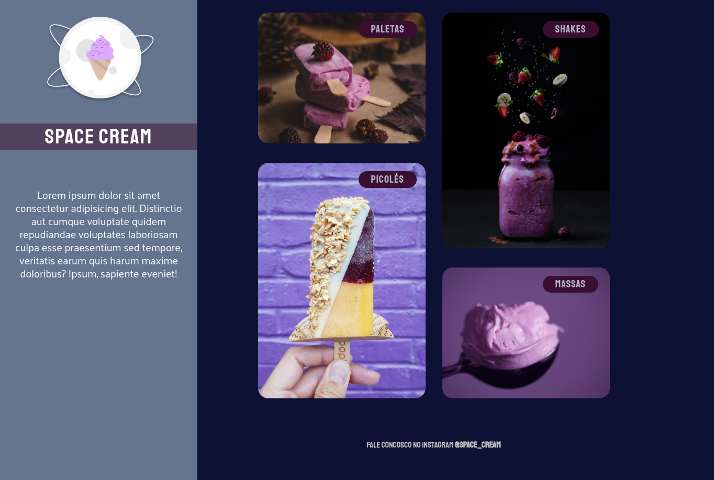
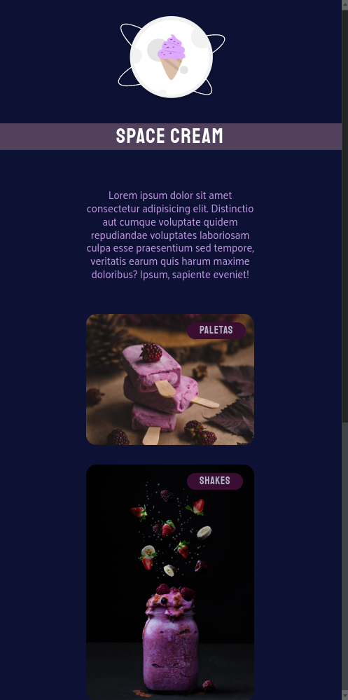

  
  
  

<h1 align="center">
    
</h1>

<h4 align="center">
	🚀 Completed project 🚀
</h4>

 <a href="#-About">About</a> •
 <a href="#-layout">Layout</a> •
 <a href="#-Technologies">Technologies</a> •
 <a href="#-author">Author</a> •
 <a href="#-license">License</a>

## 🔍 About the project
A landing page with a gallery of different types of ice cream.

## 🎨 Layout

### 💻 desktop

  

### 📱 Mobile

  

---

## 🛠 Technologies

 
  
  

 

---

## 👨‍💻 Author

<a href="https://www.linkedin.com/in/daniel-guimaraes-vieira/">
 
  
 <b>Daniel Guimarães</b></a> <a href="https://www.linkedin.com/in/daniel-guimaraes-vieira/" title="Rocketseat">🚀</a>
  

---

## 📝 License

This project is under license [MIT](./LICENSE).

Done with ❤️ por Daniel Guimarães 👋🏽 [contact!](https://www.linkedin.com/in/daniel-guimaraes-vieira/)
